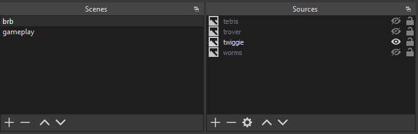
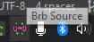

# brbscenes

A tool for twitch streamers that lets twitch chat select which brbscreen to show.

## Setup

1. [Go here](https://github.com/tlanfer/brbscenes/releases/tag/latest) and download the latest `brbscenes.exe`
2. Run the executable once. It will create an example config file named `config.yaml` that will look roughly like this:
3. 

```yaml
channel: alasdair                # What twitch channel to watch
cooldown: 30s                    # Whats the default cooldown, if a screen doesnt have a custom cooldown
                                 # The cooldown is given as a number with a unit (see https://pkg.go.dev/time#ParseDuration) 
                                 # for example: 30s, 1m, 1m30s
obs:
    brb_scene: brb               # On which scene this tool be active?
                                 # If any other scene is active, we ignore all chat messages 
    password: roflmao            # The password for your obs websocket server
    port: 4444                   # ... and its port
sources:
    - name: tetris               # The name of a source on your brb scene
      keyword: '!tetris'         # The keyword in chat to enable it ( '!'-prefix is optional)
      cooldown: 15s              # Individual cooldown for this scene (optional)
    - name: trover
      keyword: '!trover'
    - name: worms
      keyword: '!worms'
    - name: twiggie
      keyword: '!twiggie'
```

In your OBS, set up a BRB scene with the source as named in the config.
You can add other sources to the scene and the tool will only toggle those named in the config.



## Running

After the configuration is correct, just start the application. It will run as a tray icon:



If OBS is not running, it will try to (re-) connect to OBS every few seconds.
The top two hearts of the UWU mean OBS is connected, the bottom two mean twitch chat is connected.


You can exit the application via right-clicking the tray icon.

